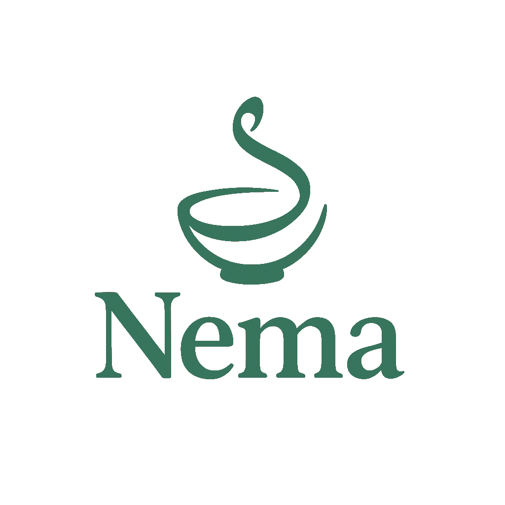

# Nema - Every Meal Is A Gift

<p align="center">
  
</p>

Nema is a smart food management application designed to reduce food waste by intelligently tracking your pantry items, planning meals based on what needs to be used first, and helping you make the most of every ingredient.

## 🌟 Features

### 🥘 AI-Powered Smart Meal Planning

- **Expiration-Date Prioritization**: Automatically uses ingredients that will expire soon
- **Recipe Variety**: Ensures diverse meals throughout your week
- **Smart Shopping List**: Minimizes new purchases by optimizing your existing inventory

### 📱 Pantry Management

- **Intuitive Interface**: Easily track all your food items
- **Expiration Tracking**: Get notified before items expire
- **Category Organization**: Keep your digital pantry organized by food types

### 📷 Smart Scanning

- **Multi-Item Scanner**: Capture and add multiple items at once
- **AI Recognition**: Intelligent food identification using computer vision
- **Barcode Scanning**: Quick addition of packaged products

## 🚀 Getting Started

### Prerequisites

- [Node.js](https://nodejs.org/) (v16 or newer)
- [Expo CLI](https://docs.expo.dev/get-started/installation/)
- Expo Go app on your mobile device or an emulator

### Installation

1. Clone the repository

   ```bash
   git clone https://github.com/yourusername/nema.git
   cd nema
   ```

2. Install dependencies

   ```bash
   npm install
   ```

3. Set up environment variables

   ```bash
   cp .env.example .env
   ```

   Then edit the `.env` file to add your API keys (see Environment Variables section)

4. Start the development server

   ```bash
   npm start
   ```

5. Open the app on your device using Expo Go by scanning the QR code in the terminal

## ⚙️ Environment Variables

Create a `.env` file with the following variables:

```
# Required for AI features
EXPO_PUBLIC_OPENAI_API_KEY=your_openai_api_key_here

# Optional - for recipe information
EXPO_PUBLIC_SPOONACULAR_API_KEY=your_spoonacular_api_key_here

# For Firebase authentication
EXPO_PUBLIC_FIREBASE_API_KEY=your_firebase_api_key
EXPO_PUBLIC_FIREBASE_APP_ID=your_firebase_app_id
```

> ⚠️ **Security Note**: Never commit your `.env` file to version control. The `.gitignore` file is configured to exclude this file.

## 📱 App Screens

- **Auth**: Simple and secure login/signup process
- **Pantry**: View and manage your food inventory
- **Meal Plan**: AI-generated meal plans based on your pantry items
- **Scanner**: Add items through camera or barcode scanning
- **Shopping List**: Smart shopping recommendations

## 🧠 AI Features

### Food Recognition

The app uses OpenAI's vision models to identify food items from photos:

- Take a photo of any food item
- AI analyzes the image and identifies the food
- Food name and category are automatically populated

### Meal Planning Algorithm

Our proprietary algorithm:

1. Analyzes your pantry items and expiration dates
2. Scores recipes based on ingredient availability and expiry dates
3. Generates optimal meal combinations to minimize waste
4. Provides explanations for why each recipe was selected

## 📂 Project Structure

```
nema/
├── app/                # Main application screens
│   ├── (tabs)/         # Tab-based navigation
│   ├── _layout.tsx     # Root layout component
│   ├── add-item.tsx    # Add item screen
│   ├── auth.tsx        # Authentication screen
│   └── ...             # Other screens
├── components/         # Reusable components
│   ├── MultiItemScanner.tsx  # Camera scanning component
│   ├── HeaderBar.tsx   # App header component
│   └── ...             # Other components
├── constants/          # App constants
├── store/              # State management
│   ├── pantryStore.ts  # Pantry state
│   ├── mealPlannerStore.ts  # Meal planner state
│   └── ...             # Other stores
├── utils/              # Utility functions
│   ├── openaiVision.ts  # OpenAI Vision API integration
│   └── ...             # Other utilities
└── ...
```

## Development and Testing

### Development with Expo

For the best development experience:

```bash
npm start
```

### Creating a Development Build

To use full native capabilities:

```bash
# Install EAS CLI
npm install -g eas-cli

# Login to your Expo account
eas login

# Create a development build
eas build --profile development --platform ios
# or
eas build --profile development --platform android
```

## License

This project is licensed under the MIT License.

## Acknowledgments

- [Expo](https://expo.dev/) for the mobile development framework
- [OpenAI](https://openai.com/) for AI-powered food identification
